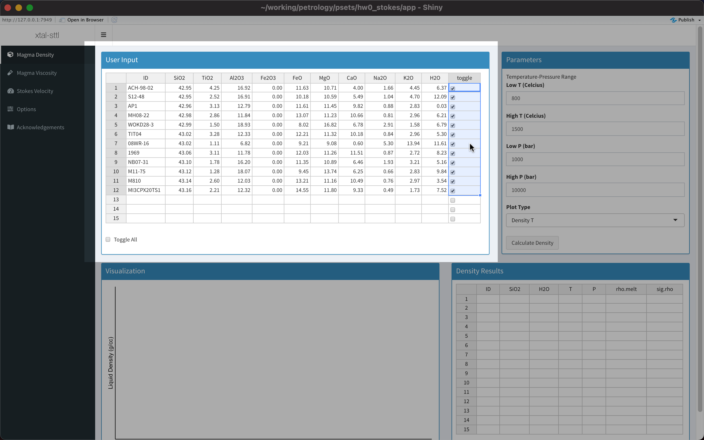

# xtal-sttl

## Introduction
`xtal-sttl` is an open source web-based app for calculating the settling velocity of spherical crystals in a silicate melt. This involves three calculations:

1. Calculate melt density using a ten-component system: SiO2-TiO2-Al2O3-Fe2O3-FeO-MgO-CaO-Na2O-K2O-H2O (code translated from python script of Iacovino and Till, 2019)

2. Calculate melt viscosity using the VFT model of Hess and Dingwell (1996):

3. Approximate settling velocity using Stoke's equation

The program uses a spreadsheet interface to input fluid compositions, including water content.

