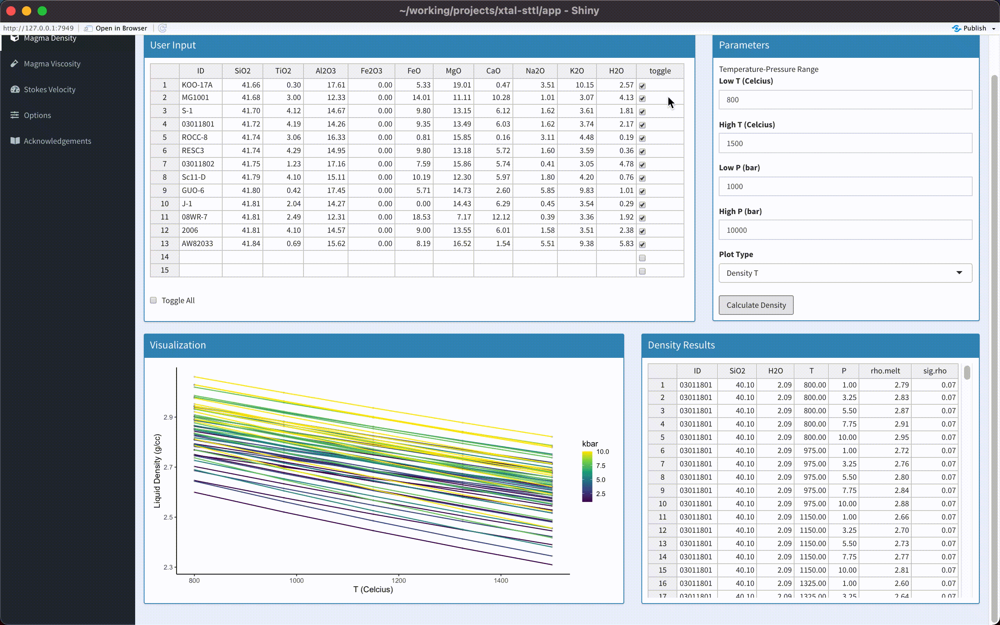
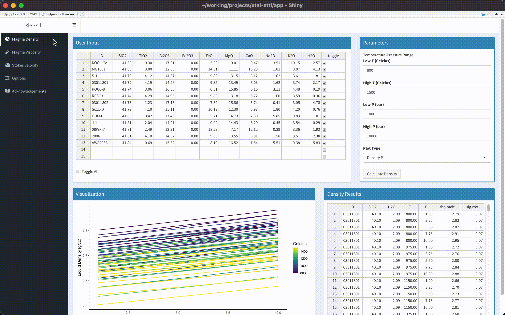

# xtal-sttl

## Introduction
`xtal-sttl` is an open source web-based app for calculating the settling velocity of spherical crystals in a silicate melts. This involves three calculations:

1. Calculate melt density using a ten-component system: SiO2-TiO2-Al2O3-Fe2O3-FeO-MgO-CaO-Na2O-K2O-H2O (code translated from python script of Iacovino and Till, 2019)

2. Calculate melt viscosity using the VFT model of Hess and Dingwell (1996)

3. Approximate settling velocity using Stokes' equation

## Running the App

[Run from a web browser](https://kerswell.shinyapps.io/xtal-sttl).

Note: *Use `command +/-` to resize app in your web browser*

Alternatively, the app can be run locally by cloning this repository `git clone https://github.com/buchanankerswell/xtal-sttl` and running `app.R`.

## Calculating Fluid Densities

The program uses a spreadsheet interface to input fluid compositions, including water content. Just copy and paste data from another spreadsheet or `.tsv`. Toggle measurements on/off by clicking the `toggle all` button, or selecting the toggle cells and hitting `return`.

Note: *The program works best with < 50 compositions, otherwise the visualizations become unreadable. A sample dataset can be found [here](https://github.com/buchanankerswell/xtal-sttl/tree/main/app/data)*

Click the `Calculate Density` button.

The results are displayed in the results table and a series of plots are used to visualize the output.

## Calculating Fluid Viscosities

Switch to the `Magma Viscosity` tab and click `Calculate Viscosity`.

Note: *Toggle samples on/off and adjust the temperature range from the `Magma Density` tab. Liquid-xtal mush viscosities are estimated using the `Crystal Fraction` input, but only the melt viscosity is considered in Stokes' equation.*

## Calculating Stokes Velocity

Switch to the `Stokes Velocity` tab and click `Calculate Velocity`.

## Saving Plots

Plots can be saved from the `Options` tab as `.pdf`s.

