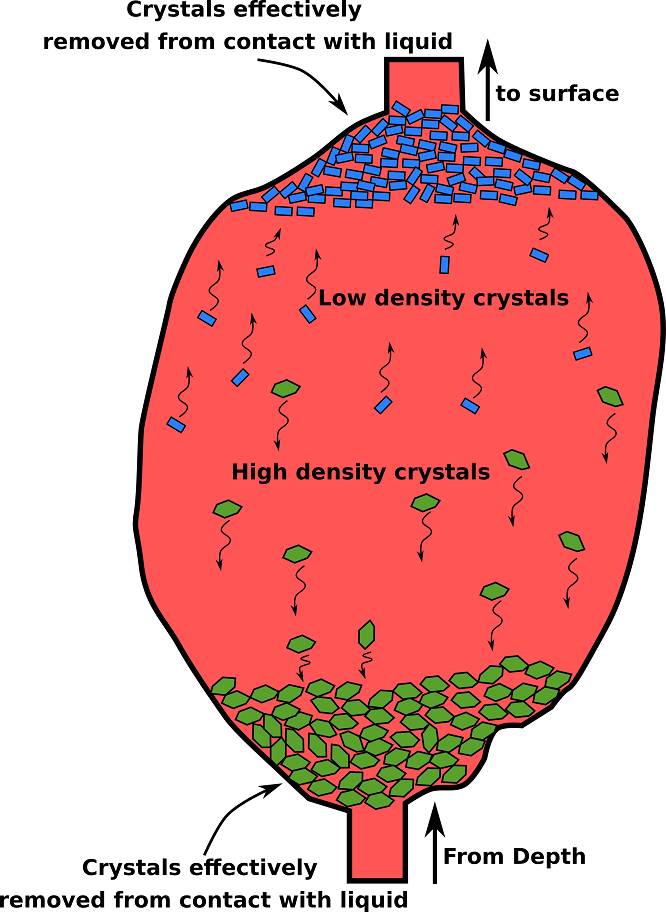

```{r setup, include=FALSE}
knitr::opts_chunk$set(echo = FALSE, message = FALSE, warning = FALSE, fig.align = 'center')
library(dplyr)
library(knitr)
library(kableExtra)
```

# Introduction

Cooling intrusions chemically differentiate in two ways:

  1. More Fe- and Mg-rich (mafic) minerals crystallize first, driving the residual melt composition to lower FeO and MgO, and higher SiO$_2$ [more felsic\; @bowen1956]
  2. Crystals may sink (or float) out of suspension, physically separating higher density (mafic) minerals from lower density (felsic) minerals (Figures 1 & 2)

<center>


{width='50%'}


</center>
<center>


{width='80%'}


</center>

## Stokes' Equation

Cumulate rock formation can be modelled using a simple solution of Stokes' Equation:

$$v = \frac{2~g~r_{crystal}^2 (\rho_{crystal} - \rho_{melt})}{9 \eta}$$

where $v$ is terminal settling velocity, $g$ is gravitational acceleration, $r$ is radius, $\rho$ is density, and $\eta$ is viscosity.

# Exercise

The `xtal-sttl` app will run in your web browser. You can use this [link](https://kerswell.shinyapps.io/xtal-sttl), or navigate to `kerswell.shinyapps.io/xtal-sttl`. A short [users' guide](https://github.com/buchanankerswell/xtal-sttl) can be found at `github.com/buchanankerswell/xtal-sttl`.

## Assumptions

Lets consider a 300-meter-thick sill that is cooling and forming spherical olivine crystals with densities of 3450 kgm$^{-3}$, and radii of 0.5 mm. The composition of the melt is given in Table 1, and intruded the crust at 1180 $^\circ$C at a depth of 4 km below the surface (~ 1000 bars).

```{r table}
tibble(ID = 'cheesemelt', SiO2 = 47.96, TiO2 = 1.69, Al2O3 = 16.88, FeO = 11.65, MnO = 0.18, MgO = 7.98, CaO = 10.44, Na2O = 2.59, K2O = 0.39, H2O = 0.24) %>% kable(caption = 'Table 1. Melt composition')
# %>% kable_minimal()
```

## Questions

Given this information, use the app `xtal-sttl` to answer the following questions:

### Olivine crystals
1. Would olivine crystals sink or float in this magma?
2. What is the Stokes velocity of olivine crystals in m/s?
3. Convert the velocity into units that make more sense, which are not extremely large or small
4. How long would it take an olivine crystal to traverse the entire thickness of the sill?

### Plagioclase crystals
Do the same calculation assuming plagioclase is crystallizing in suspension. Assume the plagioclase crystals have radii of 0.5 mm and densities of 2730 kgm$^{-3}$.

5. Would plagioclase crystals sink or float in this magma?
6. What is the Stokes velocity of plagioclase crystals (in appropriate units)?
7. How long would these plagioclase crystals take to traverse the entire thickness of the sill?

### Discussion question

Copy and paste a handful (5-10) of samples from the [dataset](https://github.com/buchanankerswell/xtal-sttl/blame/main/app/data/test-data-hydr.tsv) found at `github.com/buchanankerswell/xtal-sttl/blame/main/app/data/test-data-hydr.tsv`. Select whichever samples you want, but I suggest selecting a variation of compositions.

In your own words (3-5 sentences), describe how temperature, pressure, and melt composition (especially SiO2 and H2O) affect the density, viscosity, and settling velocity of crystals in silicate melts.

# References